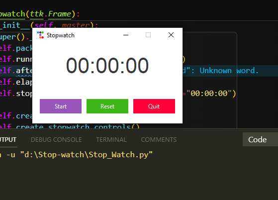

# Stop-Watch
A Stop-Watch app written in Python written by me

### Virtual env used:
1. pipenv

### packages i installed from pypi:
1. ttkbootstrap = "1.10.1"

### In built library:
1. tkinter

*I installed pyinstaller globally*

### Version of python:
1. python_version = "3.11.3"
2. pip3 = "23.0.1"
3. pip = "23.2.1"
 
## Pictures of the app interface

